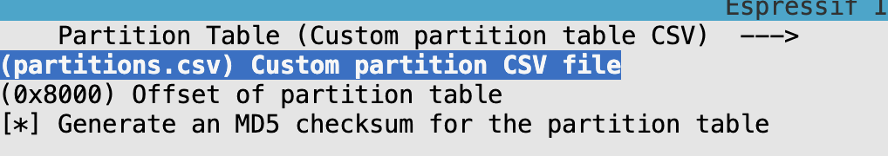

# read_atkeys

This is an example for reading the `_key.atKeys` file through SPIFFS.

## Steps

1. Create a project in an empty directory

```bash
mkdir -p my_first_project
cd my_first_project
idf.py create-project .
```

2. Change the project name in the `./CMakeLists.txt` inside of the `project()` CMake function.

3. Change the name of your main file inside of the `main/` directory (to `main.c`, for example).

4. Edit the `./main/CMakeLists.txt` file to include the `main.c` file.

```bash
idf_component_register(SRCS "main.c"
                    INCLUDE_DIRS ".")
```

5. Create a folder (can be named anything) in the root of your project. For example, I named mines `spiffs_image/`.

```bash
mkdir -p spiffs_image
```

6. Place your keys in the spiffs image folder. The contents of this folder will be flashed to the SPIFFS partition. Remove the `@` symbol from the key file name. It should be named like `alice_key.atKeys` instead of `@alice_key.atKeys`.

7. Create a partitions.csv and define the SPIFFS partition.

For example, I created `partitions.csv` with the following contents:

```csv
# Name,   Type, SubType, Offset,  Size, Flags
nvs,      data, nvs,     0x9000,  0x6000,
phy_init, data, phy,     0xf000,  0x1000,
factory,  app,  factory, 0x10000, 1M,
storage,  data, spiffs,  0x110000, 1M,
```

In this scenario, we created a partition named `storage` with the type `data` and subtype `spiffs`. The size of the partition is 1M. It is important to also note that the offset is `0x11000`.This is important because this is the offset that will be used to flash the SPIFFS image to the ESP32.

Any files in the flash image folder will be accessible via `/storage/`.

8. Your file structure should be similar to this:

```bash
main/
├── CMakeLists.txt
├── main.c
spiffs_image/
├── alice_key.atKeys
CMakelists.txt
partitions.csv
```

9. Set your ESP32's flash size appropriately by going to `idf.py menuconfig` --> "Serial flasher config" --> "Flash size". In my case, I will be changing my flash size to 4 MB because that corresponds to the ESP32 module that I am using.

10. Configure the `partitions.csv` file via `idf.py menuconfig`

```bash
idf.py menuconfig
```

Then go to "Partition Table" then "Partition Table" then select "Custom partition table CSV", then configure the name of the partition table CSV file.



Then press Q to then Y to save the configuration.

11. Create a spiffs_image.bin

Use the `spiffsgen.py` to make a SPIFFS image that will later be flashed to the ESP32 in the next step.

```bash
~/esp/esp-idf/components/spiffs/spiffsgen.py <size of image> <directory> <output binary>
```

For example, the following command will generate a 1 MB SPIFFS image from the `spiffs_image/` directory and output it to `spiffs_image.bin`.

```bash
~/esp/esp-idf/components/spiffs/spiffsgen.py 0x100000 spiffs_image/ spiffs_image.bin
```

12. Flash the SPIFFS image to the ESP32

```bash
esptool.py write_flash <offset> <spiffs image binary>
```

Example:

```bash
esptool.py write_flash 0x110000 spiffs_image.bin
```

If you accidentally mess up, you can always do:

```bash
esptool.py erase_flash
```

13. Copy and paste the following code into your `main.c` file and change the `FILE_PATH` to the path of your key file:

```c
#include <stdio.h>
#include <stdlib.h>
#include <esp_spiffs.h>
#include <esp_log.h>

#define TAG "spiffs_read"
#define FILE_PATH "/storage/soccer99_key.atKeys"

void app_main(void) {
    esp_vfs_spiffs_conf_t conf = {
        .base_path = "/storage",
        .partition_label = NULL,
        .max_files = 5,
        .format_if_mount_failed = true
    };

    esp_err_t ret = esp_vfs_spiffs_register(&conf);
    if (ret != ESP_OK) {
        if (ret == ESP_FAIL) {
            ESP_LOGE(TAG, "Failed to mount or format filesystem");
        } else if (ret == ESP_ERR_NOT_FOUND) {
            ESP_LOGE(TAG, "Failed to find SPIFFS partition");
        } else {
            ESP_LOGE(TAG, "Failed to initialize SPIFFS (%s)", esp_err_to_name(ret));
        }
        return;
    }

    // Open the key file for reading
    FILE* f = fopen(FILE_PATH, "r");
    if (f == NULL) {
        ESP_LOGE(TAG, "Failed to open key file for reading");
        esp_vfs_spiffs_unregister(NULL);
        return;
    }

    // Get file size
    fseek(f, 0, SEEK_END);
    size_t file_size = ftell(f);
    fseek(f, 0, SEEK_SET);

    // Allocate memory to hold the file content
    char* file_content = malloc(file_size + 1);
    if (file_content == NULL) {
        ESP_LOGE(TAG, "Failed to allocate memory for key file content");
        fclose(f);
        esp_vfs_spiffs_unregister(NULL);
        return;
    }

    // Read the file content into memory
    size_t read_size = fread(file_content, 1, file_size, f);
    if (read_size != file_size) {
        ESP_LOGE(TAG, "Failed to read entire file");
        free(file_content);
        fclose(f);
        esp_vfs_spiffs_unregister(NULL);
        return;
    }
    file_content[file_size] = '\0'; // Null-terminate the string

    ESP_LOGI(TAG, "Key file content: %s", file_content);

    // Clean up
    fclose(f);
    free(file_content);
    esp_vfs_spiffs_unregister(NULL);
}
```

14. Build and flash the project

```bash
idf.py build flash monitor
```

15. The expected output should be the contents of the key file.
